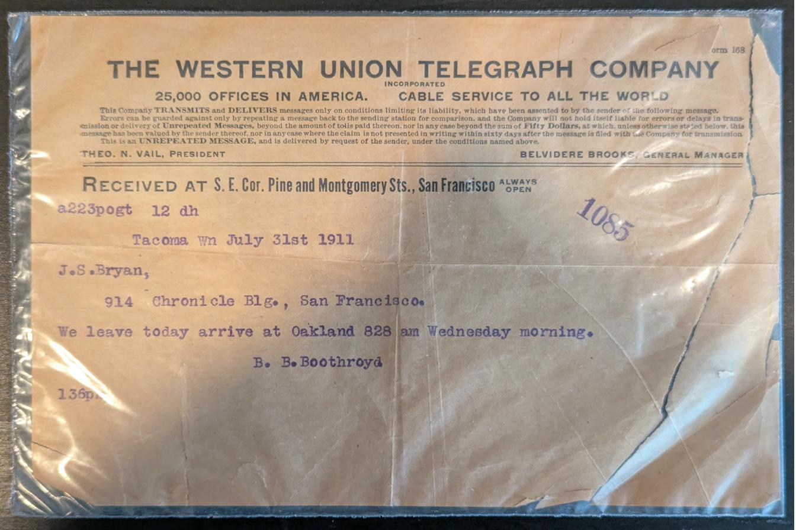
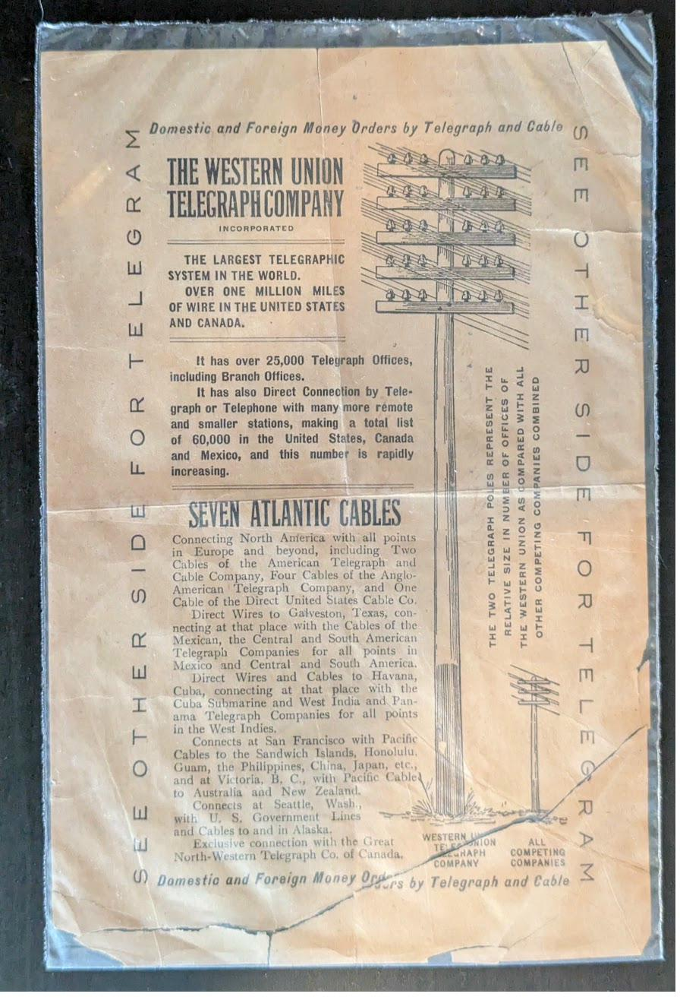

**A gift from Hans — Network Engineer — to his leadership, whose support enables him to get stuff done on the largest internet backbone in the world.**

---

### Prompt used with Claude.ai — March 8, 2026

```
Okay Claude... I need you to take these images and tell me all about them. This needs
all details for someone who's never seen this particular telegram before. I selected
these since they have the interesting infographic on the back which feels like comparing
our network to the rest of the world. I will be gifting this framed in a floating frame
(so you can view both sides) with the infographic facing forward. My name is Hans and
this is a gift for my leadership chain at work up to my VP, who enable me to get stuff
done on the largest internet backbone in the world. Please explain the correlation
between this telegraph technology and what we do today on AS3356's backbone. Can you
please format this to add to a README.md on github. I will add the URL for the github
page to an NFC tag to go on the back of the frame as an easy to reach reference.
```

---


## Western Union Telegram — Tacoma, WA to San Francisco, CA — July 31, 1911

---

## The Telegram
<p align="center"></p>

| | |
|:--|:--|
| **Form** | 168 |
| **Company** | The Western Union Telegraph Company, Incorporated |
| **Scale** | 25,000 Offices in America — Cable Service to All the World |
| **President** | Theo. N. Vail |
| **General Manager** | Belvidere Brooks |
| **Received at** | S.E. Cor. Pine and Montgomery Sts., San Francisco — *Always Open* |
| **Transmission code** | a223pogt 12 dh |
| **Receipt number** | 1085 |
| **Origin** | Tacoma, Washington |
| **Date** | July 31, 1911 |
| **To** | J.S. Bryan — 914 Chronicle Blg., San Francisco |
| **Time received** | 1:36 PM |

**Message:**

> We leave today arrive at Oakland 828 am Wednesday morning.

**Signed:** B.B. Boothroyd

---

## The Story

B.B. Boothroyd, departing Tacoma on July 31, 1911, was letting J.S. Bryan know exactly when to expect him — or them, given the "we." The party would leave Tacoma that day and arrive at the Oakland terminal at 8:28 AM on Wednesday, August 2. Bryan, at 914 Chronicle Building in San Francisco, would need to meet them, arrange transport, or simply know when they'd be accessible.

The Chronicle Building address is significant. By 1911 it was one of San Francisco's most prominent commercial addresses, home to the San Francisco Chronicle and a hub of Bay Area business. Bryan was likely a journalist, editor, or business associate of some standing. The fact that Boothroyd telegraphed him directly at his office — rather than his home — suggests this was a professional arrival being coordinated, not a personal visit.

The receiving office notation — *"Always Open"* — tells its own story. The S.E. corner of Pine and Montgomery Streets in San Francisco's Financial District was one of Western Union's flagship offices, staffed around the clock precisely because the business community it served never fully stopped. A telegram arriving at 1:36 PM on a Tuesday afternoon would have been transcribed, enveloped, and in a messenger's hands within minutes.

Theodore N. Vail listed as President is a historically notable detail. Vail was the architect of the American Telephone and Telegraph Company's national monopoly and one of the most consequential figures in communications history. His appearance on Western Union letterhead reflects the brief but significant overlap between the telegraph and telephone industries during this era of consolidation.

---

## The Cost of Every Word

Telegrams in 1911 were billed per word — roughly 25 cents for the first ten words on a standard daytime circuit, with each additional word charged on top. Address lines, punctuation, and the sender's name all counted. Every sender learned quickly to cut anything that could be inferred.

Boothroyd's message — *"We leave today arrive at Oakland 828 am Wednesday morning"* — is eleven words that serve as a complete itinerary. There is no "I hope this finds you well," no "looking forward to seeing you," not even a subject. Just departure, destination, time, and day. What's remarkable is how much precision survives the editing — a specific terminal, a specific time down to the minute, a specific day of the week. The per-word pricing model enforced a discipline that modern communication, unconstrained by cost, rarely achieves.

---

## The Route

A telegram from Tacoma, Washington to San Francisco, California in 1911 traveled one of the most established telegraph corridors in the country. The Pacific telegraph line had followed the coast since the 1860s — the same route that, just decades earlier, had carried the first transcontinental telegraph signals. By 1911, Western Union's Pacific Coast network was dense with parallel circuits running south through Seattle, Portland, and down through the Willamette Valley into California.

The distance from Tacoma to San Francisco is roughly 850 miles. The message would have been relayed through at least two or three intermediate offices — likely Portland and possibly Eugene or Sacramento — with operators at each point receiving and retransmitting the Morse signal. The whole transit, from Boothroyd's key in Tacoma to the transcription desk at Pine and Montgomery in San Francisco, would have taken well under an hour. A messenger on a bicycle handled the final blocks.

---

## The Era

July 1911 was one of the hottest summers on record in the United States. A heat wave was killing people across the Midwest and East Coast — over 380 deaths reported in a single week in July. Out on the Pacific Coast, cooler temperatures made cities like San Francisco and Tacoma relative refuges, and both were booming.

San Francisco was still rebuilding its identity five years after the 1906 earthquake and fire that had leveled much of the city. The Chronicle Building, where Bryan worked, was part of a downtown dramatically reconstructed in the intervening years — new steel-frame buildings replacing the older masonry that had crumbled. When Boothroyd's telegram arrived at Pine and Montgomery that Tuesday afternoon, it landed in a city that understood exactly what the telegraph meant and took it entirely for granted.

The Oakland terminal Boothroyd referenced was the rail hub served by the transcontinental lines — passengers arriving from the Pacific Northwest would disembark in Oakland and take a ferry across the Bay to reach San Francisco proper. The 8:28 AM arrival time was almost certainly a scheduled train arrival, not an estimate. Timetables were precise, and the telegraph existed in part to communicate when they would be kept.

---

## Western Union & The Modern Internet

The Pacific Coast telegraph corridor Boothroyd's message traveled in 1911 — copper wire following the same geography as the modern fiber routes between Seattle, Portland, and San Francisco — is a direct physical ancestor of the internet backbone running that same coastline today. The "Always Open" office at Pine and Montgomery was the 24/7 network operations posture of its era, and nothing about that requirement has changed.

---

## The Infographic
<p align="center"></p>

The reverse of this telegram is what faces forward in the floating frame. It carries the Western Union network advertisement and infographic — a statement of scale and market dominance printed on the back of every telegram the company delivered along this Pacific Coast corridor and across the country.

| | |
|:--|:--|
| **Headline** | THE WESTERN UNION TELEGRAPH COMPANY — Incorporated |
| **Tagline** | THE LARGEST TELEGRAPHIC SYSTEM IN THE WORLD. OVER ONE MILLION MILES OF WIRE IN THE UNITED STATES AND CANADA. |
| **Telegraph Offices** | Over 25,000, including Branch Offices |
| **Total connected points** | 60,000 across the United States, Canada and Mexico |

**Seven Atlantic Cables** connecting North America to Europe and beyond:

- Two cables of the American Telegraph and Cable Company
- Four cables of the Anglo-American Telegraph Company
- One cable of the Direct United States Cable Co.

Additional reach via direct wires to Galveston (onward to Mexico, Central and South America), Havana (onward to the West Indies), San Francisco (onward to Hawaii, Guam, the Philippines, China, Japan, Australia and New Zealand), and Seattle (onward to Alaska). Exclusive connection with the Great North-Western Telegraph Co. of Canada.

**The Pole Comparison:** The centerpiece is a proportional illustration of two telegraph poles drawn to scale. One represents Western Union. One represents all competing companies combined. The caption reads:

> *"The two telegraph poles represent the relative size in number of offices of the Western Union as compared with all other competing companies combined."*

Western Union operated **25,000 offices** against a combined competitor count that didn't come close. They were not competing for market share — they were the market, and they printed that fact on the back of every telegram they delivered, including the one that arrived at Pine and Montgomery for J.S. Bryan on a Tuesday afternoon in July 1911.

---

*This README is linked via NFC tag on the reverse of the frame.*
